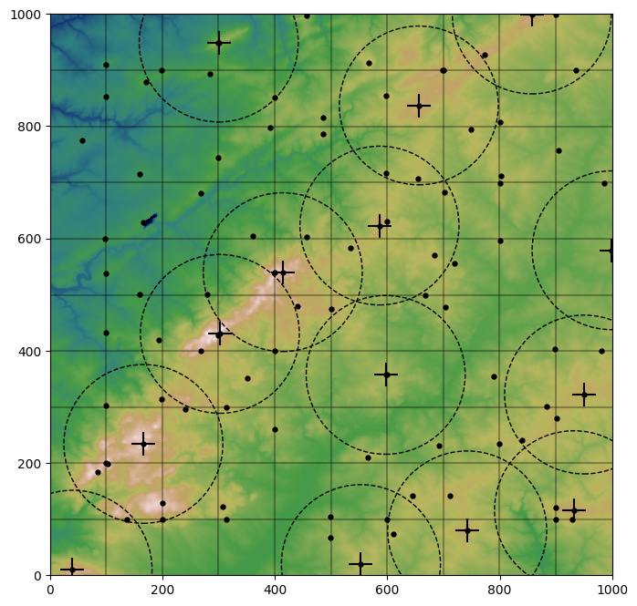

# Peak finder
_**Extract isolated peaks in digital elevation models raster data**_

For now, the script takes an ASCII Grid file as input and a radius of exclusion as parameter.
The output is a GEOjson file containing the isolated peaks coordinates and elevation.
A peak is chosen when there is no taller peak in its surrounding area, defined by the radius R.
You will also find a simpler implementation of the project in python, but it's a draft.
This is a work in progress.

## Usage
After compilation, you can run the executable with input data, example :

    ./pickpeak --infile path/to/input/filename.asc -R 5000 --outfile outdata.json

The input file is specified by -i or --infile, the output by -o or --outfile, -R set the radius in
the spatial units of the input data.

The -m or --margin option can be 1 or 0. Set to 1, a margin of width R is taken out of the output.
No peak present in the margins is returned to the JSON file. Otherwise, if m is set to 0, the peaks
returned by the computation might include peak which are closer than R to the data spatial limits.

The computation has not been tested on a set of more than 28 million points. 
For large data set, you may have to use gdal to pre-process the files. 
For dataset consisting in many files with little spatial extent,
you may have to merge them if you 
## Install and Requirements
Compile by running make in the root directory:

    make

The only nonstandard library needed for compilation is the json-c library,
you may have to adjust the Makefile, depending on your installation. 

**Note**
It is possible to check is the script working correctly using the basic 
test data by running the mainTEST.sh script in the unit_tests directory:

    ./mainTEST.sh
    

